```mermaid
graph TB
    %% Core Platform
    A[Walme.io Core Platform]

    %% Blockchain and Wallets
    subgraph Blockchain Integrations
        B[Blockchain Integrations]
        B1[Solana]
        B2[Ethereum]
        B3[Polygon]
        B4[Bitcoin]
        B5[Custodial Wallet KYC]
        B --> B1
        B --> B2
        B --> B3
        B --> B4
        B --> B5
    end
    A --> B

    %% Wallet Features
    subgraph Wallet Features
        C[Wallet Features]
        C1[Non-Custodial Wallet Core]
        C2[Jupiter Swap API]
        C3[1inch Protocol]
        C4[Staking]
        C5[Wallet Analytics]
        C --> C1
        C --> C2
        C --> C3
        C --> C4
        C --> C5
    end
    A --> C

    %% Secure Messaging
    subgraph Secure Messaging
        D[Secure Messaging]
        D1[Matrix Protocol]
        D2[Synapse Server]
        D3[End-to-End Encryption]
        D4[Audio and Video Calls]
        D --> D1
        D --> D2
        D --> D3
        D --> D4
    end
    A --> D

    %% Authentication
    subgraph Authentication Layer
        E[Authentication Layer]
        E1[Auth0]
        E2[Web3Auth]
        E --> E1
        E --> E2
    end
    A --> E

    %% AI and Analytics
    subgraph AI Analytics
        F[AI-Powered Analytics]
        F1[Risk Assessment]
        F2[Transaction Scoring]
        F3[Market Trends]
        F --> F1
        F --> F2
        F --> F3
    end
    A --> F

    %% Backend Services
    subgraph Backend Services
        G[Backend Services]
        G1[Node.js APIs]
        G2[Matrix API Extensions]
        G3[KYC AML API SUMSUB]
        G4[PostgreSQL Database]
        G --> G1
        G --> G2
        G --> G3
        G --> G4
    end
    A --> G

    %% Frontend
    subgraph Frontend Clients
        H[Frontend Clients]
        H1[iOS Swift]
        H2[Android Kotlin]
        H3[Web React.js]
        H --> H1
        H --> H2
        H --> H3
    end
    A --> H

    %% DevOps and Infrastructure
    subgraph DevOps Infrastructure
        I[DevOps Infrastructure]
        I1[Docker Containers]
        I2[Kubernetes]
        I3[NGINX Proxy]
        I4[SSL Certificates]
        I --> I1
        I --> I2
        I --> I3
        I --> I4
    end
    A --> I

    %% Compliance and Security
    subgraph Compliance and Security
        J[Compliance and Security]
        J1[PCI DSS]
        J2[VASP Licensing]
        J3[Regulatory Integration]
        J --> J1
        J --> J2
        J --> J3
    end
    A --> J

    %% Additional Integrations
    subgraph Additional Integrations
        K[Additional Integrations]
        K1[Binance API]
        K2[Wallet Addressing]
        K3[AI Bots]
        K --> K1
        K --> K2
        K --> K3
    end
    A --> K

```

# Welcome to Walme.io 🌐🚀

**Walme** is reshaping the Web3 landscape, combining **banking, blockchain**, and **secure communication** into one seamless ecosystem. Our platform empowers users to manage assets, communicate securely, and participate in decentralized finance with ease.

---

## 🌟 Key Features

- **Multichain Wallets**: Support for Solana, Ethereum, Polygon, Bitcoin, and more.
- **Secure Messenger**: Built on Matrix for encrypted messaging, voice, and video calls.
- **Crypto Cards**: Fiat on/off-ramps with custodial wallets powered by (KYC required).
- **DeFi Tools**: Token swaps and advanced analytics via Jupiter and 1inch integrations.
- **Authentication Made Simple**: Secure login via Auth0 and Web3Auth.
- **AI-Powered Analytics**: Market trends, risk assessment, and portfolio insights.
- **Cross-Platform Experience**: Native apps for iOS, Android, and web.

---

## 🛠️ Project Repositories

### Authentication Frameworks

1. **[Auth0.swift](https://github.com/walme-io/Auth0.swift)**
   - iOS library for integrating Auth0 with Swift.
   - Features include OAuth2 flows, session management, and user profile handling.

2. **[Auth0.Android](https://github.com/walme-io/Auth0.Android)**
   - Kotlin/Java library for Auth0 integration in Android apps.
   - Simplifies secure login, signup, and session handling.

3. **[Node Auth0](https://github.com/walme-io/node-auth0)**
   - Node.js SDK for Auth0 backend services.
   - Supports user management and session APIs.

---

### Wallet and DeFi Tools

4. **[Wallet Core](https://github.com/walme-io/wallet-core)**
   - Core library for multichain wallet operations.
   - Token transfers, staking, and wallet management.

5. **[WalletConnect Specs](https://github.com/walme-io/walletconnect-specs)**
   - Specifications for WalletConnect protocol integration.
   - Enables DApp-to-wallet connectivity for Web3 ecosystems.

---

### Messaging and Blockchain Integrations

6. **[Synapse](https://github.com/walme-io/synapse)**
   - Custom Matrix server optimized for secure messaging.

7. **[Matrix Rust SDK](https://github.com/walme-io/matrix-rust-sdk)**
   - Rust-based SDK for efficient Matrix protocol integration.

8. **[Matrix Spec](https://github.com/walme-io/matrix-spec)**
   - Documentation and extensions for Matrix protocol.

9. **[Jupiter Swap API Client](https://github.com/walme-io/jupiter-swap-api-client)**
   - SDK for interacting with the Jupiter Swap API.

10. **[Jupiter Swap API](https://github.com/walme-io/jupiter-swap-api)**
    - Backend service for token swaps via Jupiter.

11. **[1inch Protocol](https://github.com/walme-io/1inchProtocol)**
    - Integration of 1inch for multichain DeFi transactions.

---

### KYC and Compliance Tools

12. **[Idensic Mobile SDK Sample Android Java](https://github.com/walme-io/idensic-mobile-sdk-sample-android-java)**
    - Example Android app showcasing **SUMSUB Idensic SDK** integration for KYC/AML compliance.

13. **[Idensic Mobile SDK iOS](https://github.com/walme-io/IdensicMobileSDK-iOS)**
    - iOS library for integrating **SUMSUB Idensic SDK** for KYC processes.

---

## 🚀 Why Walme?

- **Secure and Decentralized**: Non-custodial wallets and end-to-end encrypted communications.
- **Web3 First**: Fully integrated with DeFi, NFTs, and blockchain applications.
- **User-Focused Design**: Multilingual support, intuitive UI, and consistent cross-platform experience.
- **Community-Centric**: Open collaboration and ongoing feature expansion.

---

## 🌍 Join the Community

- 🌐 [Official Website](https://walme.io/)
- 📋 [Waitlist](https://waitlist.walme.io/)
- 💬 [Discord](https://discord.gg/pcAKPbKcP2)
- 📱 [Telegram](https://t.me/walmeapp)
- 🐦 [X (Twitter)](https://x.com/walme_io)
- 🏢 [LinkedIn](https://www.linkedin.com/company/walme-io)
- 📝 [Blog](https://blog.walme.io/)

---

## 🛡️ License

This profile contains both open-source and proprietary components. Refer to individual repositories for licensing details.

---

**Walme.io**: Building the Future of Web3 Banking and Communication 🚀
